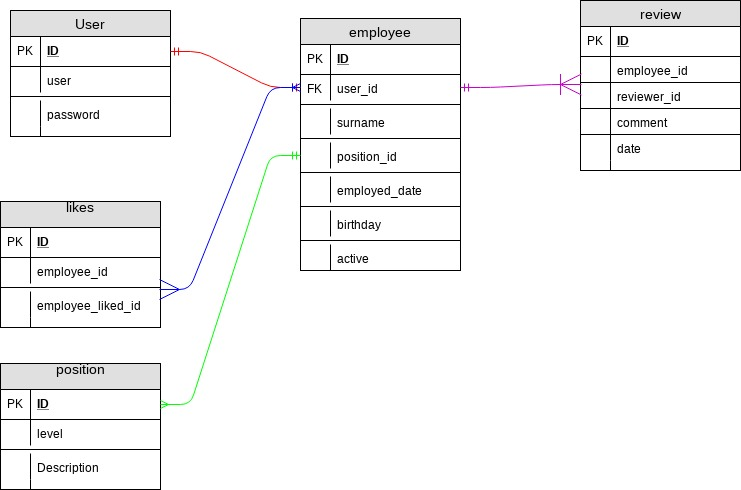

# SES
SES - Simple Employee System

The idea of this project is to have a simple employee management system, with some added function.

Dead line, 1 week from start (31/05/2018)

## Setup
1. Setup a database in mysql with the database name as 'ses' and run the script in the setup folder "table.sql"

## External libraries used
+ noty [https://ned.im/noty]
+ bootstrap 4 CND version [https://getbootstrap.com/]
+ Google jQuery library CND
+ Medialoot template [https://medialoot.com/preview/frame/bootstrap-4-dashboard.html]
+ Bootstrap4 DataTable [https://datatables.net/]

## Current database design

