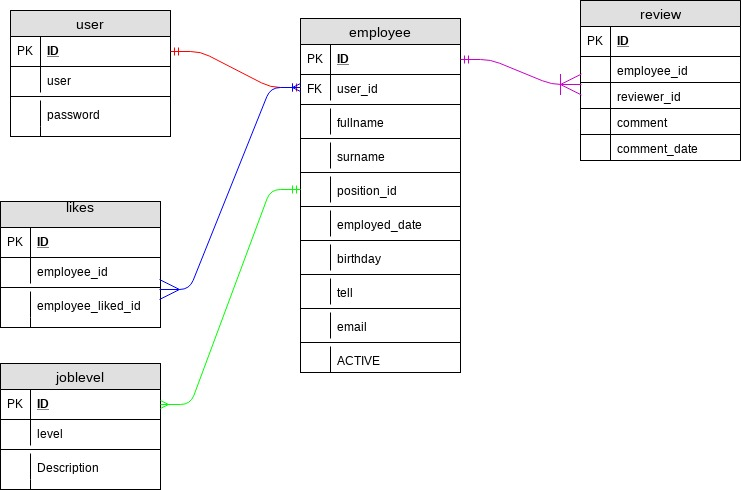

# SES
SES - Simple Employee System

The idea of this project is to have a simple employee management system, with some added function.

## Setup
1. Setup a database in mysql with the database name as 'ses' and run the script in the setup folder "table.sql"
2. Go to the folder config, edit the database connection settings

## External libraries used
+ noty [https://ned.im/noty]
+ bootstrap 4 CND version [https://getbootstrap.com/]
+ Google jQuery library CND
+ Medialoot template [https://medialoot.com/preview/frame/bootstrap-4-dashboard.html]
+ Bootstrap4 DataTable [https://datatables.net/]

## Current database design

## Resetting a user password
1. Currently any user should login
2. Go to 'PASSWORD'
3. Select the user in 'employee' select box
4. Type in 'OLD PASSWORD'
5. Type in 'NEW PASSWORD'
6. Type in 'NEW PASSWORD RETYPE' same as new password
+ If user forgot his/her old password type in 'OLD PASSWORD' the word 'RESET' all uppercase

## Notes
+ Passwords is encrypted with md5
